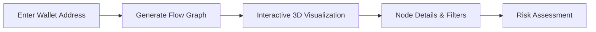
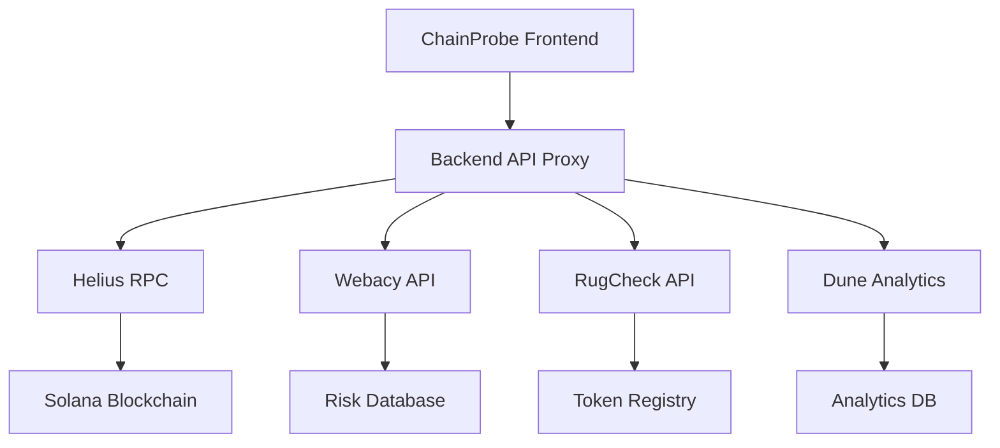

# ChainProbe

<div align="center">
  
  <h3>Advanced Blockchain Forensic Analysis Platform for Solana</h3>
  <p>Investigate transactions, analyze wallet behavior, and detect suspicious patterns on the Solana blockchain</p>

  [](https://chainprobe.vercel.app)
  [](https://youtu.be/vC2G1Ucv6W8)
  [](https://dev.to/geoffrey_kimani_18776c699/chainprobe-2h88)

  
  
  
  
  
</div>

---

## Overview

ChainProbe is a comprehensive blockchain forensic analysis platform specifically designed for the Solana ecosystem. It empowers users with advanced tools to investigate transaction flows, analyze wallet behavior patterns, identify suspicious activities, and perform comprehensive security audits on tokens and smart contracts.

### Target Audience

- **Blockchain Investigators** - Track illicit funds and investigate fraudulent activities
- **Security Researchers** - Analyze suspicious patterns and wallet behaviors  
- **DeFi Teams** - Conduct thorough due diligence on protocols and tokens
- **Token Projects** - Verify smart contract security and tokenomics
- **Individual Users** - Check wallet security and assess token safety

## Features

### Core Analysis Tools

| Feature | Description | Key Benefits |
|---------|-------------|--------------|
| **Transaction Flow Visualization** | Interactive 3D graph visualization of fund movements | • Real-time transaction mapping<br>• Identify money laundering patterns<br>• Trace fund origins and destinations |
| **Wallet Analysis** | Comprehensive wallet behavior and risk assessment | • Transaction history analysis<br>• Risk scoring with ML algorithms<br>• Activity pattern detection |
| **Transaction Clustering** | Group related transactions to reveal hidden networks | • Discover wallet clusters<br>• Identify coordinated activities<br>• Network analysis visualization |
| **Pattern Analysis** | Detect suspicious patterns and anomalies | • Wash trading detection<br>• Circular transaction identification<br>• Automated risk flagging |
| **Entity Labels** | Identify and categorize blockchain entities | • Exchange identification<br>• Protocol classification<br>• Suspicious actor flagging |

### Token Security Suite

| Tool | Purpose | Integration |
|------|---------|-------------|
| **Token Analyzer** | Comprehensive token security assessment |  |
| **Trending Tokens** | Monitor popular tokens with real-time risk scoring |  |
| **New Tokens** | Track and assess newly created tokens |  |
| **Verified Tokens** | Directory of verified secure tokens |  |

### Advanced Security Tools

- **Smart Contract Scanner** - Automated vulnerability detection and security analysis
- **Bridge Monitor** `[Beta]` - Cross-chain bridge transaction monitoring with risk assessment
- **Risk Assessment Engine** - Powered by Webacy for comprehensive threat analysis

## Technology Stack

### Frontend Architecture
```
┌─────────────────┬─────────────────┬─────────────────┐
│   Framework     │   Styling       │   State Mgmt    │
├─────────────────┼─────────────────┼─────────────────┤
│ React 18        │ Tailwind CSS    │ React Query     │
│ TypeScript      │ Framer Motion   │ Context API     │
│ Vite            │ Custom Themes   │ Local Storage   │
└─────────────────┴─────────────────┴─────────────────┘
```

### Visualization & UI
- **3D Graphs**: Force Graph React, Three.js
- **Charts**: Chart.js with date adapters
- **Flow Diagrams**: ReactFlow for network visualization
- **Animations**: Framer Motion for smooth interactions
- **Icons**: React Icons (Remix Icon set)

### Backend & APIs
```
┌─────────────────┬─────────────────┬─────────────────┐
│   Blockchain    │   Security      │   Data Sources  │
├─────────────────┼─────────────────┼─────────────────┤
│ Solana Web3.js  │ Webacy API      │ Helius RPC      │
│ Wallet Adapter  │ RugCheck API    │ Dune Analytics  │
│ RPC Endpoints   │ Jupiter API     │ Solscan API     │
└─────────────────┴─────────────────┴─────────────────┘
```

### Development & Deployment
- **Build Tool**: Vite with TypeScript
- **Deployment**: Vercel (Frontend), Render (Backend)
- **Code Quality**: ESLint, TypeScript strict mode
- **Version Control**: Git with conventional commits

## Installation & Setup

### Prerequisites


### Quick Start

1. **Clone the repository**
   ```bash
   git clone https://github.com/ge0frey/chainprobe.git
   cd chainprobe
   ```

2. **Install dependencies**
   ```bash
   # Frontend dependencies
   npm install
   
   # Backend dependencies (if running locally)
   cd backend && npm install
   ```

3. **Environment Configuration**

   **Frontend** (`.env`):
   ```bash
   # Backend API URL
   VITE_API_BASE_URL=http://localhost:3001
   
   # Solana Network Configuration
   VITE_SOLANA_NETWORK=mainnet-beta
   ```

   **Backend** (`backend/.env`):
   ```bash
   # Server Configuration
   PORT=3001
   FRONTEND_URL=http://localhost:5173
   
   # API Keys (Required for full functionality)
   HELIUS_API_KEY=your_helius_api_key_here
   DD_API_KEY=your_webacy_dd_api_key_here
   DUNE_API_KEY=your_dune_api_key_here
   ```

4. **Start the application**
   ```bash
   # Start frontend (from root directory)
   npm run dev
   
   # Start backend (from backend directory - new terminal)
   cd backend && npm run dev
   ```

5. **Access the application**
   - Frontend: `http://localhost:5173`
   - Backend API: `http://localhost:3001`

### API Keys Setup

| Service | Required | Purpose | Get API Key |
|---------|----------|---------|-------------|
| **Helius** | Yes | Solana RPC & enhanced transactions | [helius.xyz](https://helius.xyz) |
| **Webacy** | Yes | Risk assessment & security analysis | [webacy.com](https://webacy.com) |
| **Dune** | Optional | Token balance data | [dune.com](https://dune.com) |

## Usage Guide

### 🔍 Transaction Flow Analysis

**Visualize fund movements in 3D interactive graphs**



**Key Features:**
- Real-time transaction mapping
- Suspicious pattern highlighting  
- Time-based filtering
- Export capabilities

### 💼 Wallet Risk Analysis

**Comprehensive wallet behavior assessment**

| Analysis Type | Data Points | Risk Factors |
|---------------|-------------|--------------|
| **Transaction History** | Volume, frequency, patterns | Unusual activity spikes |
| **Connected Entities** | Known exchanges, protocols | Suspicious interactions |
| **Token Holdings** | Portfolio diversity, values | High-risk token exposure |
| **Activity Patterns** | Time-based behavior | Bot-like patterns |

### 🛡️ Token Security Analysis

**Multi-layered token security assessment**

```
📊 Token Analysis Pipeline
┌─────────────┐    ┌─────────────┐    ┌─────────────┐
│   Mint      │ => │   RugCheck  │ => │   Risk      │
│   Address   │    │   Analysis  │    │   Report    │
└─────────────┘    └─────────────┘    └─────────────┘
       │                   │                   │
       v                   v                   v
 Verify Address     Contract Audit      Score & Flags
```

**Assessment Categories:**
- Contract vulnerabilities
- Liquidity analysis  
- Holder distribution
- Creator background
- Market manipulation risks

## Architecture Overview

### Component Structure

```
chainprobe/
├── 🎯 src/components/           # React components
│   ├── 📊 Dashboard.tsx         # Main overview dashboard
│   ├── 🔄 TransactionFlow.tsx   # 3D transaction visualization
│   ├── 💼 WalletAnalysis.tsx    # Wallet behavior analysis
│   ├── 🛡️ TokenSecurity/        # Token analysis suite
│   ├── 🔍 PatternAnalysis.tsx   # Suspicious pattern detection
│   └── 🌐 ui/                   # Reusable UI components
├── ⚙️ src/services/             # API integrations
├── 🖥️ backend/                  # Express.js API proxy
└── 📁 public/                   # Static assets
```

### Data Flow Architecture



### API Integration Matrix

| Service | Purpose | Rate Limits | Caching |
|---------|---------|-------------|---------|
| **Helius** | Solana RPC & enhanced transactions | 5000 req/min | Redis, 30s |
| **Webacy** | Risk assessment & sanctions | 1000 req/min | Local, 5min |
| **RugCheck** | Token security analysis | 500 req/min | Redis, 1hr |
| **Dune** | Token balance analytics | 100 req/min | Local, 15min |

### Security Features

- **Rate Limiting**: Implemented on all API endpoints
- **Request Validation**: Input sanitization and validation  
- **Error Handling**: Graceful fallbacks for API failures
- **CORS Protection**: Configured for production deployment

## Contributing

We welcome contributions from the community! Here's how you can help improve ChainProbe.

### Development Guidelines


### Getting Started

1. **Fork the repository** and clone your fork
2. **Create a feature branch** from `main`
   ```bash
   git checkout -b feature/your-feature-name
   ```
3. **Install dependencies** and set up your environment
4. **Make your changes** following our coding standards
5. **Test your changes** thoroughly
6. **Submit a pull request** with a clear description

### Code Standards

- **TypeScript**: All new code must be written in TypeScript
- **Conventional Commits**: Use conventional commit messages
- **Component Structure**: Follow established patterns in `/src/components/`
- **API Integration**: Add new services to `/src/services/`
- **Error Handling**: Implement proper error boundaries and fallbacks

### Areas for Contribution

| Area | Difficulty | Description |
|------|------------|-------------|
| **UI/UX Improvements** | 🟢 Beginner | Enhance existing components and layouts |
| **API Integrations** | 🟡 Intermediate | Add new blockchain data sources |
| **Security Features** | 🔴 Advanced | Implement advanced risk detection algorithms |
| **Performance** | 🟡 Intermediate | Optimize data processing and visualization |
| **Documentation** | 🟢 Beginner | Improve guides and API documentation |

## Deployment

### Production Deployment

**Frontend** (Vercel):
```bash
# Automatic deployment from main branch
# Environment variables configured in Vercel dashboard
```

**Backend** (Render):
```bash
# Automatic deployment from main branch
# Environment variables configured in Render dashboard
```

### Environment Variables

**Production Frontend**:
```bash
VITE_API_BASE_URL=https://chainprobe-backend.onrender.com
VITE_SOLANA_NETWORK=mainnet-beta
```

**Production Backend**:
```bash
NODE_ENV=production
FRONTEND_URL=https://chainprobe.vercel.app
# API keys configured securely
```

## Performance Considerations

- **Caching Strategy**: Redis for API responses, browser cache for static assets
- **Rate Limiting**: Exponential backoff for API requests
- **Code Splitting**: Dynamic imports for heavy visualization components
- **Bundle Optimization**: Tree shaking and chunk splitting with Vite

## License

This project is licensed under the MIT License - see the [LICENSE](LICENSE) file for details.

## Acknowledgments

### APIs & Services
- **[Helius](https://helius.xyz)** - Enhanced Solana RPC and transaction data
- **[Webacy](https://webacy.com)** - Web3 security and risk assessment
- **[RugCheck](https://rugcheck.xyz)** - Token security analysis
- **[Dune Analytics](https://dune.com)** - Blockchain analytics and data

### Technology Partners
- **[Solana](https://solana.com)** - High-performance blockchain platform
- **[Vercel](https://vercel.com)** - Frontend deployment and hosting
- **[Render](https://render.com)** - Backend API hosting

---

<div align="center">
  <p>
    <strong>Built for the Solana ecosystem</strong><br>
    <sub>Empowering blockchain security and transparency</sub>
  </p>
  
  [](https://github.com/ge0frey/chainprobe/stargazers)
  [](https://twitter.com/your_twitter)
</div>
